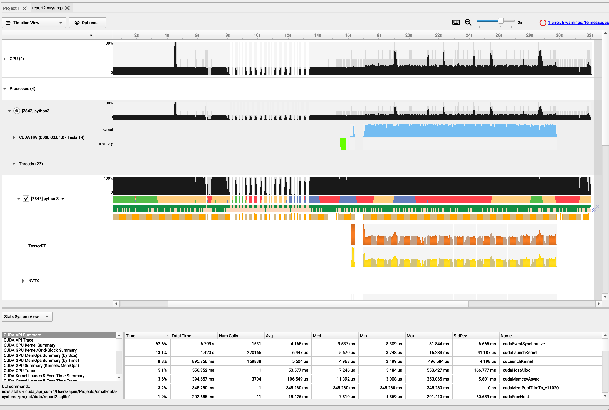

# Running on CloudLab / Google Cloud

Follow these steps to set up your experiment environment on a cloud host.

### Recommended Google Cloud Compute Instance
* T4 instances are easier to get compared to V100s. They are good enough for us, since we want to run `TensorRT-LLM` and they support it.
* Machine: `n1-standard-4`
* Architecture: `Intel Broadwell`
* IMP $\rightarrow$ Set boot disk image to: `Deep Learning VM for PyTorch 2.2 with CUDA 12.1 M119`. This image comes with a bunch of libraries pre-installed.

### CloudLab
* If you are using CloudLab, you will get a barebones machine.
* The first thing is to install the NVIDIA GPU Drivers. https://developer.nvidia.com/cuda-downloads
* Install and then run `nvidia-smi`. If this works, you are set.
* Also check that the following is active: `sudo systemctl status nvidia-persistenced`.

### First Steps
* SSH into your cloud host.
* Setup your environment. Copy over any `TMUX/VIM/ZSH/BASH` configs that you usually use.
* Install git: `apt-get -y install git git-lfs`
* Clone our project repository `small-data-systems`.
* Go to the `rosanna` app directory: `cd project/rosanna`.
* Run `setup-gc.sh`. This should install a bunch of dependencies like docker.

### Starting a new container
*  `docker compose up --force-recreate -d && docker logs -f -t rosanna-app-1`
* The above will start up the container. It will take about 10 minutes for everything to be set up.
* The last line of log will say `*** done, you can detach from logs ***`. Once this comes up, press `Ctrl+C` to detach from logging.
* The container is now up and running.

### Attaching to a container
* `docker ps` lists all running containers along with their container ids and names.
* Execute the following command to get inside the container (change name accordingly): `docker exec -i -t rosanna-app-1 bash`
* The above should give a bash shell. You will find the `TensorRT-LLM` repository in the `/` directory (note: it is the root directory and not the home directory).

### Exiting a container without killing it
* Press the following key sequence: `Ctrl+P` `Ctrl+Q`.
* This will detach you from the container. But the container will keep running.
* Run `docker ps` to verify that the container is still up.

### Killing a container
* `docker stop rosanna-app-1` stops the container gracefully. Change name if you need to.

### Copying files to and from a container
* In case you need to copy any reports or output files from the container: `docker cp rosanna-app-1:/absolute/path/to/file/in/container /path/to/destination`.
* Same works for copying files to the container: `docker cp /path/to/source/file rosanna-app-1:/absolute/path/to/file/in/container`.

### Running a model
* Attach to the container.
* Navigate to the `TensorRT-LLM` directory.
* Follow the quick start section here: https://github.com/NVIDIA/TensorRT-LLM?tab=readme-ov-file#quick-start.
* Note in your commands, you may need to use `python3` instead of `python`.

### Profiling
* A good summary is here: https://www.vi-hps.org/cms/upload/material/tw41/Nsight_Systems.pdf
* NSight Systems
    * `nsys profile -t cuda,nvtx --stats=true <your application command>`
    * Example, for the bloom summarisation workload, we can run this: 
    ```nsys profile -t cuda,nvtx --stats=true python3 ../summarize.py --test_trt_llm --hf_model_dir ./bloom/560M/ --data_type fp16 --engine_dir ./bloom/560M/trt_engines/fp16/1-gpu/```
    * This will generate a `<something>.nsys-rep` file.
    * Use `nsys stats <something>.nsys-rep` to print to stdout a text summary of the stats. 
    * You can copy this file to your local machine and dig deeper in the NSYS UI. More on this later.
* NSight Compute
    * TODO: TBH I don't think we will be needing this one.
    * NCU is used for a CUDA Kernel Level stats, which we don't require.

### More Profiling
* Install NSight Systems locally on your PC. https://developer.nvidia.com/nsight-systems/get-started
* Copy the `<something>.nsys-rep` file to your PC. Google Cloud allows downloading files from compute instances to your machine.
* A sample file is in our repo as well if you're just wanting to see how this is supposed to work: https://github.com/ajx42/small-data-systems/blob/main/project/data/report2.nsys-rep
* Open NSight Systems UI in your PC. Open the report file in this tool. This will give you timelines, charts, and tables with a lot of data.

